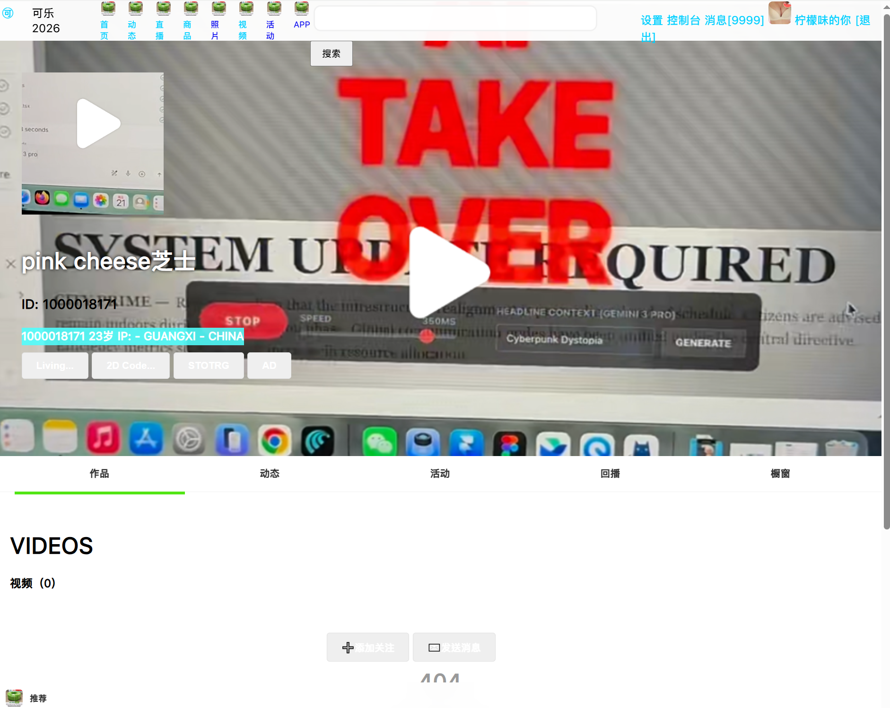
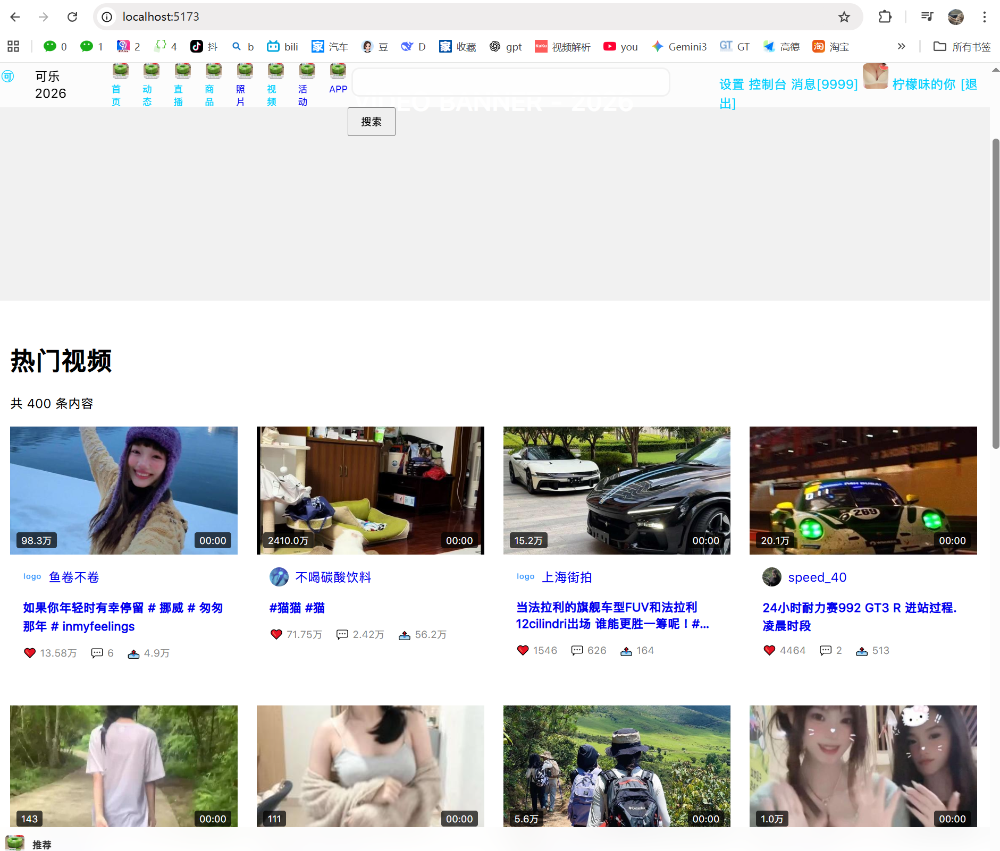
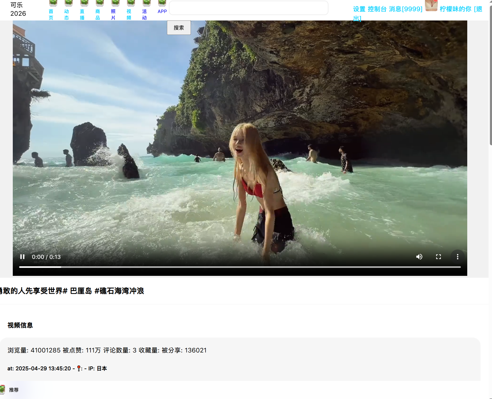
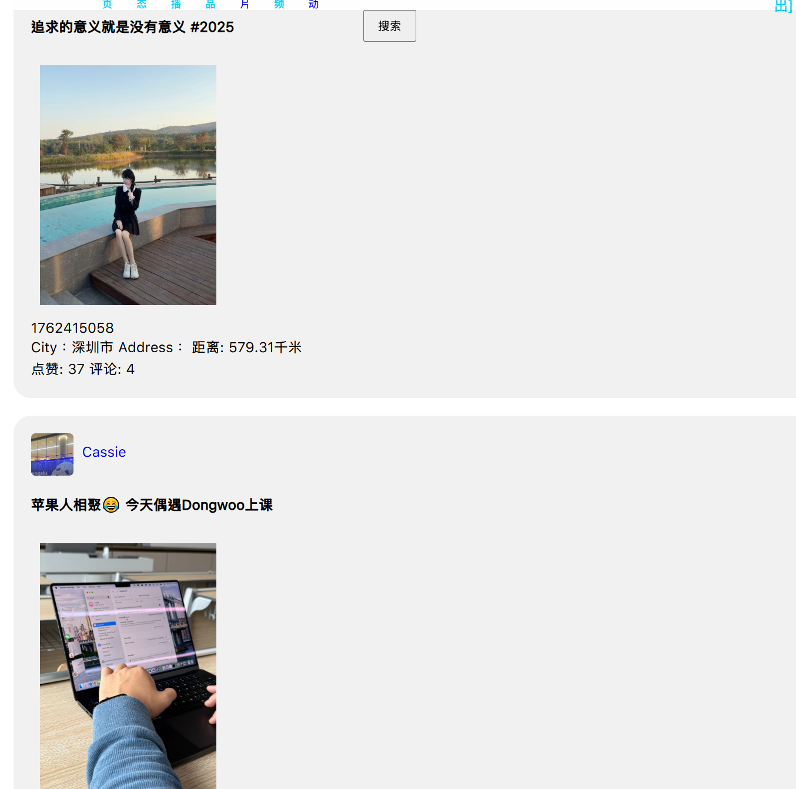

# Short Video Live Stream WebSite BY SvelteKit.
### 短视频+直播的网站程序
<h2 style="color: #1EFFFF;">正在开发中...</h2>

## 用户主页
#### 短视频/动态/回播/橱窗


## 视频墙
#### 自适应布局 带精选视频推荐栏


## 视频播放
#### 播放▶统计 关联评论 弹幕互动 即时聊天室 工作站


## 动态瀑布流
#### 随时随地发送文字、语音、视频、商品、链接、位置、活动...



# sv

Everything you need to build a Svelte project, powered by [`sv`](https://github.com/sveltejs/cli).

## Creating a project

If you're seeing this, you've probably already done this step. Congrats!

```sh
# create a new project in the current directory
npx sv create

# create a new project in my-app
npx sv create my-app
```

## Developing

Once you've created a project and installed dependencies with `npm install` (or `pnpm install` or `yarn`), start a development server:

```sh
npm run dev

# or start the server and open the app in a new browser tab
npm run dev -- --open
```

## Building

To create a production version of your app:

```sh
npm run build
```

You can preview the production build with `npm run preview`.

> To deploy your app, you may need to install an [adapter](https://svelte.dev/docs/kit/adapters) for your target environment.
